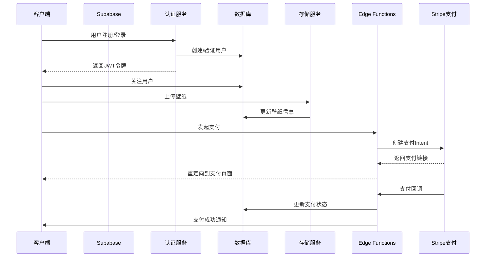
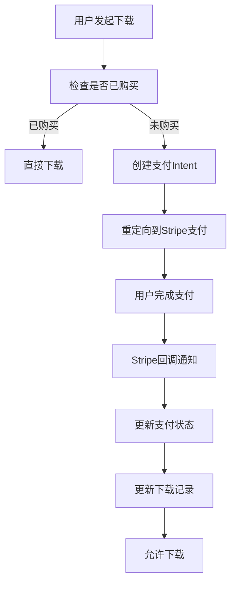

# Supabase 后端操作记录

## 1. 系统架构

### 1.1 技术栈
- **后端服务**: Supabase (PostgreSQL + Auth + Storage + Functions)
- **认证**: Supabase Auth (支持邮箱/密码、第三方登录)
- **存储**: Supabase Storage (存储壁纸文件)
- **函数**: Supabase Edge Functions (处理支付、审核等逻辑)
- **支付集成**: Stripe (处理支付流程，仅支持 Apple Pay)

### 1.2 系统架构图



## 2. 数据库设计

### 2.1 用户表 (users)
| 字段名 | 数据类型 | 约束 | 描述 |
|-------|---------|------|------|
| `id` | `uuid` | `primary key` | 用户ID (Supabase Auth生成) |
| `email` | `text` | `unique` | 邮箱 |
| `username` | `text` | `unique` | 用户名 |
| `avatar_url` | `text` | | 头像URL |
| `created_at` | `timestamp` | `default now()` | 创建时间 |
| `updated_at` | `timestamp` | `default now()` | 更新时间 |

创建用户表（users）：
```sql
CREATE TABLE public.users (
    id uuid PRIMARY KEY,
    email text UNIQUE,
    username text UNIQUE,
    avatar_url text,
    created_at timestamp DEFAULT now(),
    updated_at timestamp DEFAULT now()
);
```

### 2.2 关注关系表 (follows)
| 字段名 | 数据类型 | 约束 | 描述 |
|-------|---------|------|------|
| `id` | `serial` | `primary key` | 关系ID |
| `follower_id` | `uuid` | `references users(id)` | 关注者ID |
| `following_id` | `uuid` | `references users(id)` | 被关注者ID |
| `created_at` | `timestamp` | `default now()` | 创建时间 |

创建关注关系表（follows）：
```sql
CREATE TABLE public.follows (
  id serial PRIMARY KEY,
  follower_id uuid REFERENCES public.users(id) ON DELETE CASCADE,
  following_id uuid REFERENCES public.users(id) ON DELETE CASCADE,
  created_at timestamp DEFAULT now(),
  UNIQUE(follower_id, following_id)
);

-- 创建索引
CREATE INDEX idx_follows_follower ON public.follows(follower_id);
CREATE INDEX idx_follows_following ON public.follows(following_id);
```

### 2.3 壁纸表 (wallpapers)
| 字段名 | 数据类型 | 约束 | 描述 |
|-------|---------|------|------|
| `id` | `uuid` | `primary key` | 壁纸ID |
| `user_id` | `uuid` | `references users(id)` | 上传用户ID |
| `title` | `text` | | 壁纸标题 |
| `description` | `text` | | 壁纸描述 |
| `file_path` | `text` | | 存储路径 |
| `thumbnail_path` | `text` | | 缩略图路径 |
| `price` | `decimal` | | 下载价格 |
| `is_approved` | `boolean` | `default false` | 是否审核通过 |
| `download_count` | `integer` | `default 0` | 下载次数 |
| `created_at` | `timestamp` | `default now()` | 创建时间 |
| `updated_at` | `timestamp` | `default now()` | 更新时间 |

创建壁纸表（wallpapers）：
```sql
CREATE TABLE public.wallpapers (
  id uuid PRIMARY KEY,
  user_id uuid REFERENCES public.users(id) ON DELETE CASCADE,
  title text,
  description text,
  file_path text,
  thumbnail_path text,
  price decimal(10,2),
  is_approved boolean DEFAULT false,
  download_count integer DEFAULT 0,
  created_at timestamp DEFAULT now(),
  updated_at timestamp DEFAULT now()
);

-- 创建索引
CREATE INDEX idx_wallpapers_user ON public.wallpapers(user_id, is_approved);
CREATE INDEX idx_wallpapers_approved ON public.wallpapers(is_approved);
```

### 2.4 下载记录表 (downloads)
| 字段名 | 数据类型 | 约束 | 描述 |
|-------|---------|------|------|
| `id` | `serial` | `primary key` | 记录ID |
| `user_id` | `uuid` | `references users(id)` | 下载用户ID |
| `wallpaper_id` | `uuid` | `references wallpapers(id)` | 壁纸ID |
| `amount` | `decimal` | | 支付金额 |
| `service_fee` | `decimal` | | 服务费 |
| `status` | `text` | | 状态 (pending/completed/failed) |
| `created_at` | `timestamp` | `default now()` | 创建时间 |
| `completed_at` | `timestamp` | | 完成时间 |

创建下载记录表（downloads）：
```sql
CREATE TABLE public.downloads (
  id serial PRIMARY KEY,
  user_id uuid REFERENCES public.users(id) ON DELETE CASCADE,
  wallpaper_id uuid REFERENCES public.wallpapers(id) ON DELETE CASCADE,
  amount decimal(10,2),
  service_fee decimal(10,2),
  status text,
  created_at timestamp DEFAULT now(),
  completed_at timestamp,
  UNIQUE(user_id, wallpaper_id)
);

-- 创建索引
CREATE INDEX idx_downloads_user ON public.downloads(user_id);
CREATE INDEX idx_downloads_wallpaper ON public.downloads(wallpaper_id);
CREATE INDEX idx_downloads_status ON public.downloads(status);
```

### 2.5 支付记录表 (payments)
| 字段名 | 数据类型 | 约束 | 描述 |
|-------|---------|------|------|
| `id` | `text` | `primary key` | 支付ID (Stripe生成) |
| `user_id` | `uuid` | `references users(id)` | 用户ID |
| `download_id` | `integer` | `references downloads(id)` | 下载记录ID |
| `amount` | `decimal` | | 支付金额 |
| `currency` | `text` | | 货币类型 |
| `status` | `text` | | 支付状态 |
| `created_at` | `timestamp` | `default now()` | 创建时间 |
| `updated_at` | `timestamp` | `default now()` | 更新时间 |

创建支付记录表（payments）：
```sql
CREATE TABLE public.payments (
  id text PRIMARY KEY,
  user_id uuid REFERENCES public.users(id) ON DELETE CASCADE,
  download_id integer REFERENCES public.downloads(id) ON DELETE CASCADE,
  amount decimal(10,2),
  currency text,
  status text,
  created_at timestamp DEFAULT now(),
  updated_at timestamp DEFAULT now()
);

-- 创建索引
CREATE INDEX idx_payments_user ON public.payments(user_id);
CREATE INDEX idx_payments_status ON public.payments(status);
```

## 3. API 设计

### 3.1 认证相关

#### 3.1.1 用户注册
- **端点**: `POST /auth/v1/signup`
- **参数**:
  - `email`: 邮箱
  - `password`: 密码
  - `data`: 额外信息 (用户名、头像等)
- **返回**: JWT令牌和用户信息

#### 3.1.2 用户登录
- **端点**: `POST /auth/v1/token`
- **参数**:
  - `email`: 邮箱
  - `password`: 密码
- **返回**: JWT令牌和用户信息

### 3.2 用户关系

#### 3.2.1 关注用户
- **端点**: `POST /follows`
- **参数**:
  - `following_id`: 被关注用户ID
- **返回**: 关注关系

#### 3.2.2 取消关注
- **端点**: `DELETE /follows/{id}`
- **参数**:
  - `id`: 关注关系ID
- **返回**: 成功状态

#### 3.2.3 获取关注列表
- **端点**: `GET /users/{id}/following`
- **参数**:
  - `id`: 用户ID
- **返回**: 关注用户列表

#### 3.2.4 获取粉丝列表
- **端点**: `GET /users/{id}/followers`
- **参数**:
  - `id`: 用户ID
- **返回**: 粉丝用户列表

### 3.3 壁纸管理

#### 3.3.1 上传壁纸
- **端点**: `POST /wallpapers`
- **参数**:
  - `title`: 标题
  - `description`: 描述
  - `price`: 价格
  - `file`: 文件 (通过Storage上传)
- **返回**: 壁纸信息

#### 3.3.2 获取用户壁纸
- **端点**: `GET /users/{id}/wallpapers`
- **参数**:
  - `id`: 用户ID
  - `approved`: 是否只返回审核通过的
- **返回**: 壁纸列表

#### 3.3.3 获取壁纸详情
- **端点**: `GET /wallpapers/{id}`
- **参数**:
  - `id`: 壁纸ID
- **返回**: 壁纸详细信息

#### 3.3.4 搜索壁纸
- **端点**: `GET /wallpapers/search`
- **参数**:
  - `query`: 搜索关键词
  - `page`: 页码
  - `limit`: 每页数量
- **返回**: 壁纸列表

### 3.4 支付相关

#### 3.4.1 创建支付
- **端点**: `POST /payments`
- **参数**:
  - `wallpaper_id`: 壁纸ID
  - `amount`: 支付金额
- **返回**: 支付Intent和支付链接

#### 3.4.2 验证支付状态
- **端点**: `GET /payments/{id}`
- **参数**:
  - `id`: 支付ID
- **返回**: 支付状态

#### 3.4.3 获取用户购买的壁纸
- **端点**: `GET /users/{id}/purchases`
- **参数**:
  - `id`: 用户ID
- **返回**: 已购买壁纸列表

### 3.5 审核相关

#### 3.5.1 审核壁纸
- **端点**: `PUT /wallpapers/{id}/approve`
- **参数**:
  - `id`: 壁纸ID
  - `approved`: 是否通过
- **返回**: 审核结果

#### 3.5.2 获取待审核壁纸
- **端点**: `GET /wallpapers/pending`
- **参数**:
  - `page`: 页码
  - `limit`: 每页数量
- **返回**: 待审核壁纸列表

## 4. 认证与权限

### 4.1 认证流程
1. 用户通过邮箱/密码注册
2. Supabase Auth创建用户并返回JWT令牌
3. 客户端存储JWT令牌用于后续请求
4. 所有API请求都需要携带JWT令牌进行验证

### 4.2 权限控制
- **用户表**: 只允许用户访问自己的信息
- **壁纸表**: 
  - 上传者可以管理自己的壁纸
  - 审核通过的壁纸对所有用户可见
  - 未审核的壁纸只对上传者和管理员可见
- **下载表**: 只允许用户访问自己的下载记录
- **支付表**: 只允许用户访问自己的支付记录

### 4.3 RLS (行级安全) 策略

#### 用户表策略
配置配置 RLS (行级安全) 策略：
```sql
-- 启用 RLS
ALTER TABLE public.users ENABLE ROW LEVEL SECURITY;
ALTER TABLE public.follows ENABLE ROW LEVEL SECURITY;
ALTER TABLE public.wallpapers ENABLE ROW LEVEL SECURITY;
ALTER TABLE public.downloads ENABLE ROW LEVEL SECURITY;
ALTER TABLE public.payments ENABLE ROW LEVEL SECURITY;

-- 用户表策略
CREATE POLICY "Users can access own profile" ON public.users
  FOR SELECT USING (auth.uid() = id);

CREATE POLICY "Users can update own profile" ON public.users
  FOR UPDATE USING (auth.uid() = id);

-- 壁纸表策略
CREATE POLICY "Public can view approved wallpapers" ON public.wallpapers
  FOR SELECT USING (is_approved = true);

CREATE POLICY "Users can view own wallpapers" ON public.wallpapers
  FOR SELECT USING (auth.uid() = user_id);

CREATE POLICY "Users can insert own wallpapers" ON public.wallpapers
  FOR INSERT WITH CHECK (auth.uid() = user_id);

CREATE POLICY "Users can update own wallpapers" ON public.wallpapers
  FOR UPDATE USING (auth.uid() = user_id);

-- 下载表策略
CREATE POLICY "Users can view own downloads" ON public.downloads
  FOR SELECT USING (auth.uid() = user_id);

CREATE POLICY "Users can create downloads" ON public.downloads
  FOR INSERT WITH CHECK (auth.uid() = user_id);

-- 支付表策略
CREATE POLICY "Users can view own payments" ON public.payments
  FOR SELECT USING (auth.uid() = user_id);
```
设置存储桶和权限：
- 创建存储桶 ：

- wallpapers (私有)
- thumbnails (公共)
- avatars (公共)
- 配置存储规则 ：

- 允许用户上传自己的壁纸
- 允许用户访问已购买的壁纸

## 5. 支付流程

### 5.1 支付流程



### 5.2 服务费用计算
- **服务费比例**: 总金额的 10%
- **计算公式**: `服务费 = 支付金额 × 0.1`
- **实际到账**: `实际到账 = 支付金额 - 服务费`

### 5.3 支付状态管理
| 状态 | 描述 | 操作 |
|------|------|------|
| `pending` | 支付中 | 等待用户完成支付 |
| `completed` | 支付成功 | 允许下载 |
| `failed` | 支付失败 | 提示用户重新支付 |
| `refunded` | 已退款 | 取消下载权限 |

## 6. 存储设计

### 6.1 存储桶结构
- **`wallpapers`**: 存储壁纸文件
  - 权限: 私有 (需要通过API访问)
- **`thumbnails`**: 存储缩略图
  - 权限: 公共 (直接访问)
- **`avatars`**: 存储用户头像
  - 权限: 公共 (直接访问)

### 6.2 文件命名规范
- **壁纸文件**: `{user_id}/{wallpaper_id}/{filename}`
- **缩略图文件**: `{user_id}/{wallpaper_id}/thumbnail.jpg`
- **头像文件**: `{user_id}/avatar.jpg`

### 6.3 文件处理
1. 上传时生成缩略图
2. 验证文件格式和大小
3. 支持的格式: MP4, MOV, GIF, WebM
4. 最大文件大小: 100MB

## 7. 审核流程

### 7.1 审核状态
| 状态 | 描述 | 可见性 |
|------|------|--------|
| `pending` | 待审核 | 仅上传者和管理员可见 |
| `approved` | 审核通过 | 所有用户可见 |
| `rejected` | 审核拒绝 | 仅上传者可见 |

### 7.2 审核标准
1. 内容健康，无违法违规内容
2. 无版权纠纷
3. 文件格式正确，播放正常
4. 缩略图清晰

### 7.3 审核操作
- 管理员可以批量审核
- 审核通过后自动发布
- 审核拒绝需要填写原因

## 8. 性能优化

### 8.1 数据库优化
- 使用索引加速查询
  - `users(username)`
  - `wallpapers(user_id, is_approved)`
  - `downloads(user_id, wallpaper_id)`
- 使用分页减少数据传输
- 预加载关联数据减少N+1查询

### 8.2 存储优化
- 使用CDN加速文件分发
- 实现文件缓存机制
- 支持断点续传

### 8.3 API优化
- 使用Edge Functions处理复杂逻辑
- 实现请求限流防止滥用
- 缓存热点数据

## 9. 安全性

### 9.1 认证安全
- 使用HTTPS加密传输
- 密码使用bcrypt加密存储
- 实现速率限制防止暴力破解
- 支持双因素认证

### 9.2 数据安全
- 敏感数据加密存储
- 定期备份数据库
- 实现数据审计日志

### 9.3 支付安全
- 使用Stripe的PCI合规支付流程
- 不在本地存储支付信息
- 实现支付签名验证

## 10. 集成指南

### 10.1 客户端集成

#### 10.1.1 初始化Supabase
```swift
import Supabase

let supabaseUrl = "YOUR_SUPABASE_URL"
let supabaseKey = "YOUR_SUPABASE_ANON_KEY"

let supabase = SupabaseClient(
  supabaseUrl: supabaseUrl,
  supabaseKey: supabaseKey
)
```

#### 10.1.2 用户注册
```swift
do {
  let session = try await supabase.auth.signUp(
    email: "user@example.com",
    password: "password123",
    data: [
      "username": "username"
    ]
  )
  print("注册成功: \(session.user.id)")
} catch {
  print("注册失败: \(error)")
}
```

#### 10.1.3 上传壁纸
```swift
// 上传文件到Storage
let fileUrl = URL(fileURLWithPath: "path/to/wallpaper.mp4")
let fileData = try Data(contentsOf: fileUrl)

let storageResponse = try await supabase.storage
  .from("wallpapers")
  .upload(
    path: "\(userId)/\(UUID().uuidString)/wallpaper.mp4",
    file: fileData
  )

// 创建壁纸记录
let wallpaper = try await supabase
  .from("wallpapers")
  .insert([
    "title": "壁纸标题",
    "description": "壁纸描述",
    "price": 9.99,
    "file_path": storageResponse.path,
    "user_id": userId
  ])
  .select()
  .single()
  .execute()
```

#### 10.1.4 发起 Apple Pay 支付
```swift
// 发起支付请求
let paymentResponse = try await supabase
  .functions
  .invoke("create-payment", args: [
    "wallpaper_id": wallpaperId,
    "amount": 9.99
  ])

// 使用 Stripe PaymentSheet 处理 Apple Pay 支付
if let clientSecret = paymentResponse["client_secret"] as? String {
    // 配置 Stripe PaymentSheet
    let configuration = STPPaymentSheet.Configuration()
    configuration.applePay = .init(
        merchantId: "your_merchant_id",
        merchantCountryCode: "CN"
    )
    
    STPPaymentSheet.shared.paymentSheetFlowController = .init(
        paymentIntentClientSecret: clientSecret,
        configuration: configuration
    )
    
    // 显示 Apple Pay 支付界面
    let paymentSheet = STPPaymentSheet(paymentSheetFlowController: STPPaymentSheet.shared.paymentSheetFlowController!)
    paymentSheet.present(from: self) { paymentResult in
        switch paymentResult {
        case .completed:
            print("支付成功")
        case .canceled:
            print("支付取消")
        case .failed(let error):
            print("支付失败: \(error.localizedDescription)")
        }
    }
}
```

#### 10.1.5 Apple Pay 验证
```swift
// 验证 Apple Pay 商户
let validationResponse = try await supabase
  .functions
  .invoke("apple-pay-validation", args: [
    "validation_url": applePayValidationURL,
    "domain": "your-domain.com"
  ])

if let merchantSession = validationResponse["merchant_session"] as? [String: Any] {
    // 使用 merchantSession 完成 Apple Pay 验证
}
```
```

### 10.2 Edge Functions 实现

#### 10.2.1 创建 Apple Pay 支付函数
```typescript
import { serve } from 'https://deno.land/std@0.168.0/http/server.ts'
import Stripe from 'https://esm.sh/stripe@11.1.0'
import { createClient } from 'https://esm.sh/@supabase/supabase-js@2.0.0'

const stripe = new Stripe(Deno.env.get('STRIPE_SECRET_KEY')!, {
  apiVersion: '2022-11-15',
})

const supabase = createClient(
  Deno.env.get('SUPABASE_URL')!,
  Deno.env.get('SUPABASE_SERVICE_ROLE_KEY')!
)

serve(async (req) => {
  try {
    const { wallpaper_id, amount } = await req.json()
    
    // 计算服务费
    const serviceFee = amount * 0.1
    const totalAmount = Math.round(amount * 100)
    
    // 创建支付Intent，仅支持 Apple Pay
    const paymentIntent = await stripe.paymentIntents.create({
      amount: totalAmount,
      currency: 'cny',
      payment_method_types: ['apple_pay'],
      metadata: {
        wallpaper_id,
        service_fee: serviceFee.toString()
      },
      automatic_payment_methods: {
        enabled: true
      }
    })
    
    return new Response(JSON.stringify({
      client_secret: paymentIntent.client_secret,
      payment_intent_id: paymentIntent.id
    }), {
      headers: { 'Content-Type': 'application/json' }
    })
  } catch (error) {
    return new Response(JSON.stringify({ error: error.message }), {
      status: 500,
      headers: { 'Content-Type': 'application/json' }
    })
  }
})
```

#### 10.2.2 Apple Pay 验证函数
```typescript
import { serve } from 'https://deno.land/std@0.168.0/http/server.ts'
import Stripe from 'https://esm.sh/stripe@11.1.0'

const stripe = new Stripe(Deno.env.get('STRIPE_SECRET_KEY')!, {
  apiVersion: '2022-11-15',
})

serve(async (req) => {
  try {
    const { validation_url, domain } = await req.json()
    
    if (!validation_url || !domain) {
      return new Response(
        JSON.stringify({ error: 'validation_url and domain are required' }),
        { status: 400, headers: { 'Content-Type': 'application/json' } }
      )
    }
    
    const merchantSession = await stripe.terminal.connectionTokens.create({
      validation_url,
      domain
    })
    
    return new Response(JSON.stringify({
      merchant_session: merchantSession
    }), {
      headers: { 'Content-Type': 'application/json' } }
    )
  } catch (error) {
    return new Response(JSON.stringify({ error: error.message }), {
      status: 500,
      headers: { 'Content-Type': 'application/json' }
    })
  }
})
```

#### 10.2.2 支付回调函数
```typescript
import { serve } from 'https://deno.land/std@0.168.0/http/server.ts'
import { createClient } from 'https://esm.sh/@supabase/supabase-js@2.0.0'

const supabase = createClient(
  Deno.env.get('SUPABASE_URL')!,
  Deno.env.get('SUPABASE_SERVICE_ROLE_KEY')!
)

serve(async (req) => {
  const payload = await req.text()
  const sig = req.headers.get('stripe-signature')!
  
  // 验证Stripe签名
  // 省略签名验证代码...
  
  const event = JSON.parse(payload)
  
  if (event.type === 'payment_intent.succeeded') {
    const paymentIntent = event.data.object
    const { wallpaper_id, service_fee } = paymentIntent.metadata
    
    // 更新支付状态
    await supabase
      .from('payments')
      .update({ status: 'completed' })
      .eq('id', paymentIntent.id)
    
    // 创建下载记录
    await supabase
      .from('downloads')
      .insert({
        user_id: paymentIntent.customer,
        wallpaper_id,
        amount: paymentIntent.amount / 100,
        service_fee: parseFloat(service_fee),
        status: 'completed'
      })
  }
  
  return new Response('OK', { status: 200 })
})
```

## 11. 部署与维护

### 11.1 环境配置
- **开发环境**: 免费Supabase项目
- **生产环境**: 付费Supabase项目 (根据用户量选择合适的计划)

### 11.2 监控与日志
- 使用Supabase Dashboard监控数据库性能
- 配置日志记录关键操作
- 设置告警机制

### 11.3 扩展与升级
- 根据用户量扩展数据库资源
- 定期备份数据
- 实现平滑升级方案

## 12. 总结

本设计文档提供了完整的Supabase后端架构方案，支持动态壁纸软件的所有核心功能：

1. **用户系统**: 注册、登录、关注
2. **内容系统**: 上传、审核、展示壁纸
3. **支付系统**: 购买、下载、服务费计算
4. **安全系统**: 认证、权限、数据保护

通过Supabase的一体化服务，大大简化了后端开发复杂度，同时提供了可靠的性能和安全性。系统设计考虑了可扩展性，可以随着用户量的增长平滑升级。